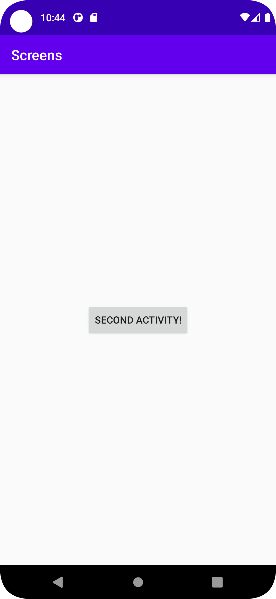
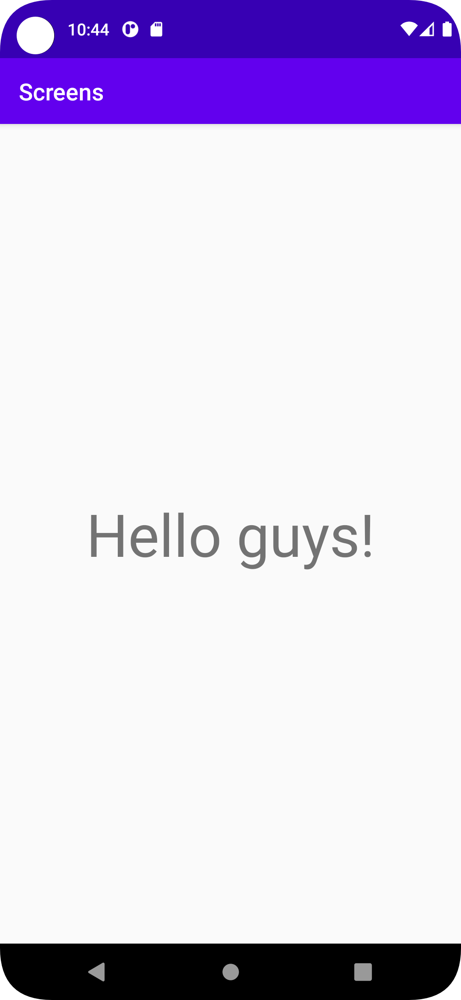

# Rapport Activities & Intents
Det första som gjordes var att skapa den andra aktiviteten. Detta gjordes genom att högerklicka på
java mappen -> new -> activity -> empty activity. Jag kollade även i androidmanifesten och den
fanns redan där så den behövde inte skapas där. Av detta skapades en java fil och en xml fil.

Det andra som gjordes var att skapa knappen som skulle ta appen till SecondActivity. Detta gjordes
genom att byta TextViewn som låg där till en Button. Den fick även ett ID.

```
    <Button
        android:id="@+id/SecondActivityButton"
        android:layout_width="wrap_content"
        android:layout_height="wrap_content"
        android:text="Second activity!"
        app:layout_constraintBottom_toBottomOf="parent"
        app:layout_constraintLeft_toLeftOf="parent"
        app:layout_constraintRight_toRightOf="parent"
        app:layout_constraintTop_toTopOf="parent" />
```

Det tredje som gjordes var att skapa en onClickListener i `MainActivity.java`. Detta gjordes genom
att lägga in dessa rader kod i onCreate.

```
        Button button =(Button)findViewById(R.id.SecondActivityButton);

        button.setOnClickListener(new View.OnClickListener(){
            @Override
            public void onClick(View view) {

            }
        });
```

OnClickListenern "lyssnar" efter om man trycker på knappen och sedan kör den koden som ligger i
onClick efter knappen klickas.

Efter detta skapades en TextView i `activity_second.xml`.

```
    <TextView
        android:layout_width="wrap_content"
        android:layout_height="wrap_content"
        app:layout_constraintStart_toStartOf="parent"
        app:layout_constraintBottom_toBottomOf="parent"
        app:layout_constraintEnd_toEndOf="parent"
        app:layout_constraintTop_toTopOf="parent"
        android:textSize="50sp"
        android:id="@+id/SecondActivityTextView"
        />
```

Efter detta skapades intentet i `MainActivity.java` detta gjordes genom att lägga till

```
        final Intent intent = new Intent(MainActivity.this, SecondActivity.class);
```

i onCreate och

```

                startActivity(intent);
```

i onClick. Det denna kod gör är att den skapar en intent som är att gå från MainActivity till
SecondActivity och sedan startar SecondActivity i onClick.

Efter detta läggs extras till. Vilket resulterar i en onCreate som ser ut så här.

```
    protected void onCreate(Bundle savedInstanceState) {
        super.onCreate(savedInstanceState);
        setContentView(R.layout.activity_main);

        Button button =(Button)findViewById(R.id.SecondActivityButton);
        final Intent intent = new Intent(MainActivity.this, SecondActivity.class);

        button.setOnClickListener(new View.OnClickListener(){
            @Override
            public void onClick(View view) {
                intent.putExtra("Message", "Hello guys!");
                startActivity(intent);
            }
        });
```

För att få extra meddelandet att visas på den andra aktiviteten så skapades denna koden i
`SecondActivity.java` under onCreate.

```
        textView = (TextView) findViewById(R.id.SecondActivityTextView);
        if (extras != null) {
            textView.setText(extras.getString("Message"));
        }
```
det denna kod gör är att kolla om det finns extras och om det finns så sätter den TextViewn i
`activity_second.xml` till den strängen som finns där.




